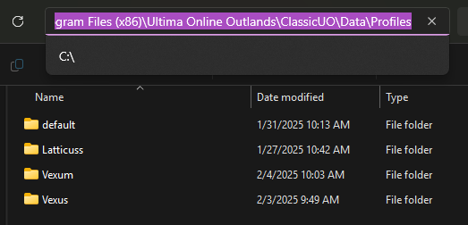
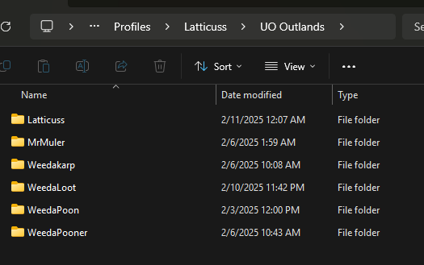

# uo-outlands-profiles
This repo is used for storing Profiles related to Ultima Online Classic Client. Currently tested with Outlands shard w/ UO Razor.

## Why is this needed?

When a character is new to outlands the entire interface at its bare bones is nearly unplayable.  This is just a simple attempt at simplfying UO for new players as well as those who want to learn or contribute to making the learning curve a bit less burdensom.

Although it is beyond me how a 25+ year old game doesn't provide general features such as Macros, Hotkeys, or Interface interactions you can greatly customize it to your liking.  These are general purpose templates with the following items customized for you.  What you can assume is profile specific naming will reflect the expected experience.  I.e. A `Miner` template will give you the `Miner` customizations but you are free to adjust this to your playstyle.

1. Cooldowns - provided by Jase and updated here (link to uo razor). This is just handy because cooldowns now become visible.
1. Macros also included for each template.
1. Macros Buttons also included for each template.
1. Counter Grid with preconfigured item types based on the template used.
1. Targeting, Spell, WASD movement, and much more.

## How to update your profiles

1. Download the zip files from GitHub by clicking the following link to download the repo code [HERE](https://github.com/cwjking611/uo-outlands-profiles/archive/refs/heads/main.zip)
1. Extract the files
1. Know the install path for your Ultima Online Classic Files.

These specific profiles are meant to be loaded into the character files to replace the various `*.xml` files.

`C:\Program Files (x86)\Ultima Online Outlands\ClassicUO\Data\Profiles` - Example

Here I can see 3 different accounts I've creatd with my single outlands Id:

Clicking the accounts created will reveal the characters currently created on the accounts as shown below. I click on the account > and now see my `character names`.

Click `Uo Outlands`

And now we see our characters:

Double Click the Character Folder and paste the contents of whichever profile template you wish to use located in `./Profiles` 

Worth Mentions:
1. Special Thanks to JaseOwns for all his helps in scripting and teachning newbie players like me and others if interested in scripting please check out https://outlands.uorazorscripts.com

## To Do

1. Include Razor profiles to streamline the play
1. Keep in mind PVP scripts will be dead soon so we may not have to focus on those
1. Need a general crafter template
1. May need a general scavenger / lock picker template
1. Need a Tamer / Summon specific template (these may need to be 2)
1. Need a Barder Specific Template